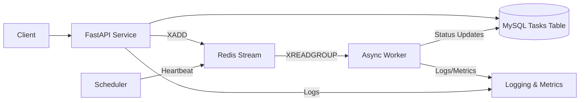

# Task Runner X Architecture

## Overview
Task Runner X is a lightweight asynchronous job processing platform built around a FastAPI service,
MySQL persistence, Redis Streams messaging, and Python worker & scheduler processes. It exposes an
HTTP API for task submission and inspection, stores canonical task state in MySQL via SQLAlchemy,
and relies on Redis Streams to coordinate background execution handled by dedicated worker
processes. Optional scheduling automation periodically enqueues maintenance tasks (e.g.
heartbeats), while observability utilities provide structured logging and in-memory metrics.

## Component Map
### API Service (FastAPI)
The API process initialises a FastAPI application, wires in routers, and manages the lifecycle of the
Redis queue connection on startup and shutdown hooks.【F:taskrunnerx/app/main.py†L2-L27】 The task
router handles health checks, task creation, and task listing/inspection. When a task is created the
service opens a database session, persists the task row, and enqueues a corresponding Redis Stream
message.【F:taskrunnerx/app/api/routes/__init__.py†L12-L35】【F:taskrunnerx/app/deps.py†L5-L15】 Pydantic
schemas validate request/response payloads.【F:taskrunnerx/app/schemas.py†L7-L29】

### Persistence Layer (MySQL + SQLAlchemy)
Database access is provided through SQLAlchemy’s engine/session factories configured from
environment-driven settings.【F:taskrunnerx/app/db.py†L2-L17】【F:taskrunnerx/app/config.py†L6-L36】 The
`Task` model captures task metadata, runtime status, and timestamps for auditing purposes.【F:taskrunnerx/app/models.py†L6-L19】
A helper script bootstraps schema creation for local environments.【F:taskrunnerx/scripts/init_db.py†L2-L12】

### Messaging Queue (Redis Streams)
The queue abstraction wraps an async Redis client, lazily opening the connection and pushing task
messages to a configured stream with bounded history. Messages carry task identifiers, names, and
JSON payloads for workers to consume.【F:taskrunnerx/app/services/queue.py†L9-L36】 Queue settings are
derived from the shared configuration module.【F:taskrunnerx/app/config.py†L19-L25】

### Worker Service
Workers join a Redis consumer group, claim messages, and execute task handlers. Before running a
task, the worker transitions task state to `running`; upon completion (or failure) it updates the
record and acknowledges the message in Redis.【F:taskrunnerx/worker/worker.py†L16-L91】【F:taskrunnerx/app/services/tasks.py†L12-L47】
Worker configuration, logging, and timing utilities allow per-process tuning and basic observability.【F:taskrunnerx/worker/config.py†L6-L14】【F:taskrunnerx/worker/logging.py†L6-L13】【F:taskrunnerx/worker/metrics.py†L5-L11】

### Scheduler
An optional scheduler process keeps the queue warm by periodically enqueuing heartbeat tasks using
APScheduler, honouring OS signals for graceful shutdown.【F:taskrunnerx/scheduler/scheduler.py†L14-L33】

### Observability
The repository includes a shared logging helper and a simple in-memory metrics collector to support
instrumentation across services.【F:taskrunnerx/logging.py†L1-L24】【F:taskrunnerx/metrics.py†L1-L38】
Workers also emit structured log lines around task execution.【F:taskrunnerx/worker/worker.py†L43-L65】

### Clients / UI
TaskRunnerX currently exposes its functionality through the REST API documented in the README (task
submission, retrieval, and health endpoints).【F:README.md†L27-L34】 There is no dedicated web UI; API
clients or CLIs interact directly with the service.

### Deployment & Runtime Topology
Docker Compose definitions orchestrate MySQL, Redis, API, worker, and scheduler containers to mirror
the production topology for local development.【F:docker-compose.yml†L1-L43】 Each container relies on
Python 3.11 slim images configured via dedicated Dockerfiles for the API, worker, and scheduler
processes.【F:Dockerfile.api†L1-L7】【F:Dockerfile.worker†L1-L7】【F:Dockerfile.scheduler†L1-L7】 The
Makefile exposes convenience targets for running services and local tooling such as formatting and
linting.【F:Makefile†L1-L22】

## Data Flow
1. **Task submission:** A client calls `POST /api/tasks`, the API persists a new task row and pushes a
   matching message to the Redis stream.【F:taskrunnerx/app/api/routes/__init__.py†L16-L21】【F:taskrunnerx/app/services/queue.py†L23-L33】
2. **Task execution:** A worker consumes the stream entry, marks the task as running, executes the
   registered handler, updates completion status, and acknowledges the message.【F:taskrunnerx/worker/worker.py†L34-L65】【F:taskrunnerx/app/services/tasks.py†L18-L40】
3. **Task inspection:** Clients query task metadata via `GET /api/tasks/{id}` or listing endpoints
   backed by SQLAlchemy queries.【F:taskrunnerx/app/api/routes/__init__.py†L24-L35】
4. **Scheduled automation:** The scheduler periodically enqueues heartbeat tasks to monitor
   processing health.【F:taskrunnerx/scheduler/scheduler.py†L14-L22】

## CI & Automation Overview
Local automation is facilitated via the Makefile (app run targets, formatting with Black, linting with
Ruff).【F:Makefile†L1-L22】 However, the repository lacks any checked-in CI pipelines or workflow
configuration, so formatting, linting, and tests must currently be run manually.
